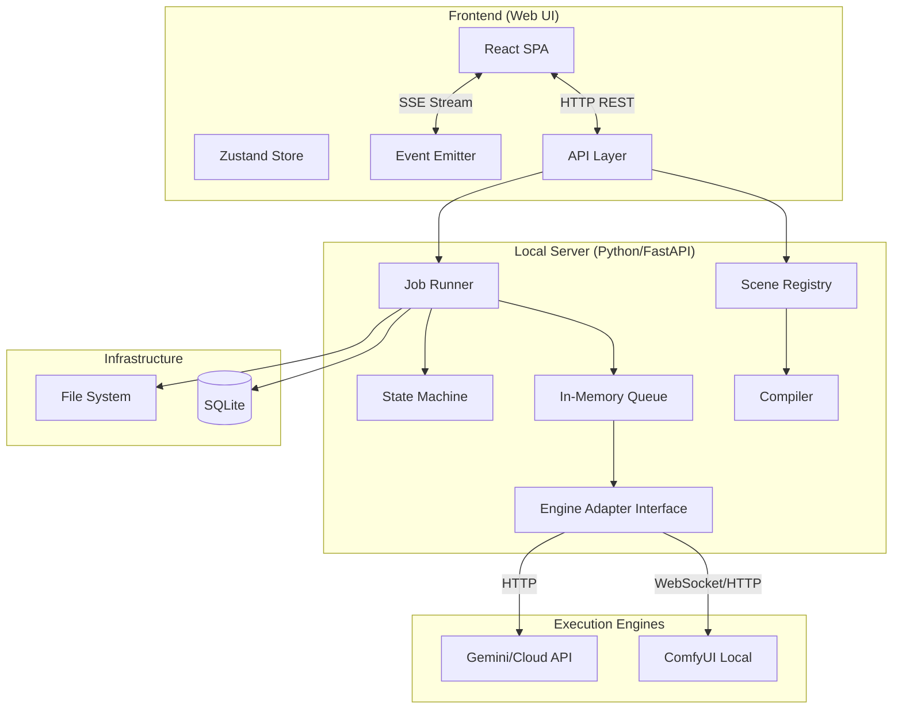
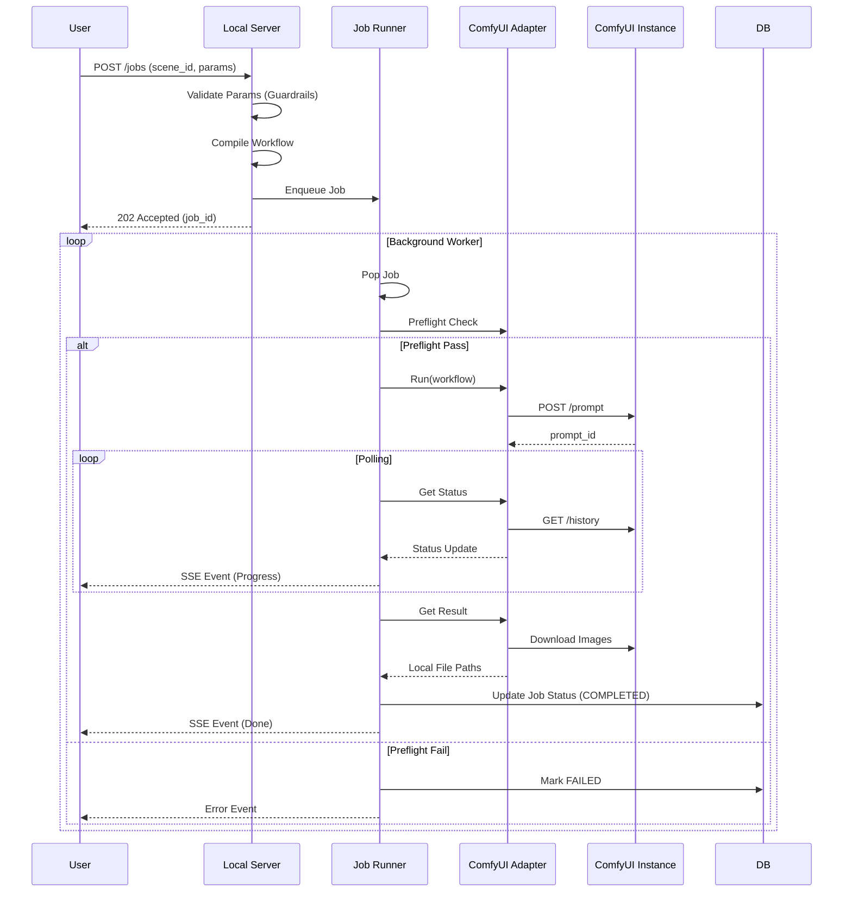

# Runner v0.2 技术架构文档 (Technical Architecture)

> **版本**：v0.2 | **状态**：RFC (Request for Comments) | **代号**：Local-First Production
> **目标**：打造一个本地闭环、多引擎兼容、稳定可复现的 AI 生产控制台。

---

## 1. 核心设计理念 (Core Philosophy)

Runner v0.2 的架构决策围绕以下核心原则展开，旨在解决 AI 生产中的不可控与高成本问题：

*   **🎯 Scene-first (场景优先)**
    *   用户交互的单元是“场景 (Scene)”（如“绘本插图”、“电商展台”），而非底层的 Prompt 或 Node。
    *   **UI 驱动**：UI 根据 Scene Schema 动态生成，而非硬编码表单。
*   **🔌 Engine-agnostic (引擎无关)**
    *   上层业务逻辑不感知底层执行器。ComfyUI 是默认引擎，但架构支持未来扩展至 Gemini/Midjourney API。
*   **🛡️ Guardrails (参数护栏)**
    *   **白名单机制**：只暴露经过测试的参数，隐藏底层复杂性（Seed/Sampler/Latent）。
    *   **安全边界**：在输入端拦截会导致 OOM 或崩坏的参数组合。
*   **🩺 Preflight First (体检先行)**
    *   **可运行性保证**：在任务提交前，强制检查模型、节点、连接性，消灭“运行时玄学报错”。
*   **🏠 Local-first (本地优先)**
    *   **零运维**：默认单机执行、SQLite 本地存储、文件系统归档。
    *   **数据主权**：除非明确使用云端引擎，否则所有 Prompt 和生成的图片均不离本地。

---

## 2. 系统架构 (System Architecture)

系统采用典型的 **CS 架构 (Client-Server)**，前端为单页应用 (SPA)，后端为轻量级本地服务器。



### 2.1 模块分层

| 层级 | 模块 | 职责 |
| :--- | :--- | :--- |
| **Presentation** | **Web UI** | 场景展示、表单渲染 (RJSF)、结果预览、历史记录。 |
| **Application** | **Local Server** | 业务逻辑核心。处理场景加载、任务调度、状态广播。 |
| **Domain** | **Scene Registry** | 管理场景模板、参数校验 (Guardrails)、Payload 编译。 |
| **Infrastructure** | **Engine Adapters** | 屏蔽底层引擎差异，提供统一的 Run/Status/Result 接口。 |
| **Storage** | **SQLite + FS** | 任务元数据存 DB，图片文件存文件系统（按日期/任务归档）。 |

---

## 3. 核心子系统详解 (Core Subsystems)

### 3.1 场景引擎 (Scene Engine)

**Scene (场景)** 是系统的核心资产，每个场景是一个独立的包。

*   **结构定义**：
    *   `schema.json`: 定义 UI 表单结构 (JSON Schema)。
    *   `guardrails.ts/py`: 参数校验逻辑（范围、依赖关系）。
    *   `template.json`: 带有占位符的底层工作流模板 (ComfyUI Workflow)。
    *   `compiler.py`: 将用户输入 (Intent) 转换为引擎可执行的 Payload。
    *   `manifest.json`: 依赖清单 (需要的 Checkpoint/LoRA/Nodes)。

### 3.2 任务调度 (Job Runner)

为保证单机稳定性，v0.2 采用**保守的调度策略**。

*   **内存队列 (In-Memory Queue)**:
    *   不引入 Redis，直接使用 Python `asyncio.Queue`。
    *   **Concurrency = 1**: 默认串行执行，严格防止显存溢出 (OOM)。
*   **状态机 (State Machine)**:
    *   `PENDING` -> `PREFLIGHT` -> `RUNNING` -> `PROCESSING` -> `COMPLETED` / `FAILED`
*   **容错机制**:
    *   任务超时自动终止。
    *   服务重启后，未完成的任务标记为 `FAILED` (v0.2 不做断点续传)。

### 3.3 引擎适配器 (Engine Adapters)

通过适配器模式隔离底层引擎差异。所有适配器必须实现以下接口：

```python
class EngineAdapter(ABC):
    @abstractmethod
    async def preflight(self, manifest: SceneManifest) -> CheckReport:
        """环境检查：连接性、模型存在性、节点完整性"""
        pass

    @abstractmethod
    async def run(self, payload: Any) -> str:
        """提交任务，返回 engine_job_id"""
        pass

    @abstractmethod
    async def status(self, engine_job_id: str) -> TaskStatus:
        """查询任务状态"""
        pass

    @abstractmethod
    async def result(self, engine_job_id: str) -> List[str]:
        """获取生成结果（下载并返回本地路径）"""
        pass
    
    @abstractmethod
    async def cancel(self, engine_job_id: str) -> bool:
        """取消任务"""
        pass
```

---

## 4. 数据流 (Data Flow)

### 4.1 任务提交与执行流程



---

## 5. 目录结构 (Directory Structure)

```text
runner-v0.2/
├── apps/
│   ├── web/                  # 前端 (React/Vue)
│   └── server/               # 后端 (FastAPI)
│       ├── src/
│       │   ├── scenes/       # [核心] 场景库
│       │   │   ├── storybook-v1/
│       │   │   │   ├── template.json
│       │   │   │   ├── schema.json
│       │   │   │   └── manifest.json
│       │   │   └── ...
│       │   ├── engines/      # [核心] 引擎适配
│       │   │   ├── base.py
│       │   │   ├── comfyui/
│       │   │   └── gemini/
│       │   ├── jobs/         # 队列与调度
│       │   │   ├── queue.py
│       │   │   └── runner.py
│       │   ├── preflight/    # 环境检查逻辑
│       │   ├── database/     # SQLite ORM
│       │   └── main.py       # API 入口
│       └── ...
├── data/                     # 运行时数据 (不入库)
│   ├── db/                   # tasks.db
│   ├── outputs/              # 生成结果归档
│   └── logs/
└── docs/                     # 开发者文档
```

---

## 6. API 设计 (API Surface)

v0.2 保持最小接口集，专注于核心生产流程。

| 方法 | 路径 | 描述 |
| :--- | :--- | :--- |
| **Scene** | | |
| `GET` | `/api/scenes` | 获取所有可用场景列表（含元数据）。 |
| `GET` | `/api/scenes/{id}` | 获取特定场景的完整 Schema 和默认值。 |
| **Job** | | |
| `POST` | `/api/jobs` | 提交新任务。Body: `{scene_id, params}`。 |
| `GET` | `/api/jobs` | 获取任务历史列表（支持分页）。 |
| `GET` | `/api/jobs/{id}` | 获取任务详情及结果。 |
| `POST` | `/api/jobs/{id}/cancel` | 取消进行中的任务。 |
| `GET` | `/api/events` | **SSE 端点**，全双工推送任务状态变更。 |
| **System** | | |
| `GET` | `/api/system/health` | 检查后端及连接的引擎状态。 |

---

## 7. 风险与缓解 (Risk Mitigation)

| 风险点 | 缓解对策 |
| :--- | :--- |
| **显存溢出 (OOM)** | **串行队列**：严格控制并发数为 1。<br>**Guardrails**：在 Schema 中限制最大分辨率和 Batch Size。 |
| **ComfyUI 插件缺失** | **Preflight**：任务运行前比对 `manifest.json` 与 ComfyUI `/object_info`，缺节点直接报错并给出安装链接，不尝试运行。 |
| **版本腐化** | **Scene Versioning**：场景模板版本化。旧任务关联旧版本 Scene，确保“一个月后还能重现”。 |
| **安装部署困难** | **One-Click Script**：提供便携版 Python 环境，一键启动。所有依赖打包在 `venv` 中。 |

---

## 8. 路线图 (Roadmap)

### v0.2 (当前目标)
*   [x] 基础 API 框架与数据库连接。
*   [x] ComfyUI 基础适配 (Submit/Poll/Download)。
*   [ ] **重构**：引入真正的内存队列 (Queue) 替代 BackgroundTasks。
*   [ ] **重构**：实现 Scene Registry，剥离硬编码工作流。
*   [ ] **新增**：实现基础 Preflight (检查节点是否存在)。

### v0.3 (下一阶段)
*   [ ] Gemini 引擎适配。
*   [ ] 场景包的热更新/在线下载。
*   [ ] 简单的用户鉴权 (针对多人共用一台机器的场景)。
